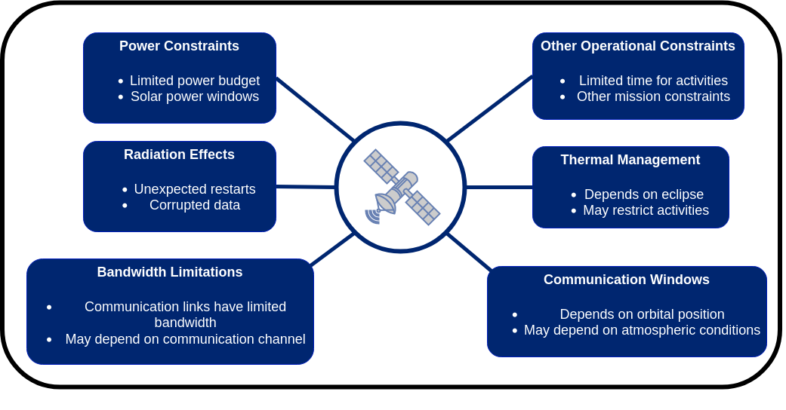

## PASEOS - PAseos Simulates the Environment for Operating multiple Spacecraft

  


 


<p align="left">
    <a href="https://paseos.readthedocs.io/en/latest/"><strong>Explore the docs »</strong></a>
    ·
    <a href="https://github.com/aidotse/PASEOS/issues">Report Bug</a>
    ·
    <a href="https://github.com/aidotse/PASEOS/issues">Request Feature</a>
</p>

Disclaimer: This project is currently under development. Use at your own risk.

<!-- TABLE OF CONTENTS -->
<details open="open">
  <summary>Table of Contents</summary>
  <ol>
    <li><a href="#about-the-project">About the Project</a></li>
    <li><a href="#paseos-space-environment-simulation">PASEOS space environment simulation</a></li>
    <li><a href="#installation">Installation</a></li>
    <li><a href="#examples">Examples</a></li>
    <ul>
    <li><a href="#actors">Actors</a></li>
    <ul>
    <li><a href="#create-a-paseos-actor">Create a PASEOS actor</a></li>
    <li><a href="#local-and-known-actors">Local and Known Actors</a></li>
    </ul>
    <li><a href="#physical-models">Physical Models</a></li>
    <ul>
    <li><a href="#set-an-orbit-for-a-paseos-spacecraftactor">Set an orbit for a PASEOS SpacecraftActor</a></li>
    <li><a href="#how-to-add-a-communication-device">How to add a communication device</a></li>
    <li><a href="#how-to-add-a-power-device">How to add a power device</a></li>
    <li><a href="#thermal-modelling">Thermal Modelling</a></li>
    <li><a href="#radiation-modelling">Radiation Modelling</a></li>
    </ul>
    <li><a href="#simulation-settings">Simulation Settings</a></li>
    <ul>
    <li><a href="#initializing-paseos">Initializing PASEOS</a></li>
    <li><a href="#using-the-cfg">Using the cfg</a></li>
    <li><a href="#faster-than-real-time-execution">Faster than real-time execution</a></li>
    <li><a href="#event-based-mode">Event-based mode</a></li>
    </ul>
    <li><a href="#activities">Activities</a></li>
    <ul>
    <li><a href="#simple-activity">Simple Activity</a></li>
    <li><a href="#activities-with-inputs-and-outputs">Activities with Inputs and Outputs</a></li>
    <li><a href="#constraint-function">Constraint Function</a></li>
    <li><a href="#on-termination-function">On-termination Function</a></li>
    </ul>
    <li><a href="#utilities">Utilities</a></li>
    <ul>
    <li><a href="#visualization">Visualization</a></li>
    <li><a href="#monitoring-simulation-status">Monitoring Simulation Status</a></li>
    <li><a href="#writing-simulation-results-to-a-file">Writing Simulation Results to a File</a></li>
    </ul>
    </ul>
    <li><a href="#system-design-of-paseos">System Design of PASEOS</a></li>
    <li><a href="#glossary">Glossary</a></li>
    <li><a href="#contributing">Contributing</a></li>
    <li><a href="#license">License</a></li>
    <li><a href="#contact">Contact</a></li>
  </ol>
</details>

## About the project

PASEOS is a `Python` module that simulates the environment to operate multiple spacecraft. In particular, PASEOS offers the user some utilities to run their own [activities](#activity) by taking into account both operational and onboard (e.g. limited-power-budget, radiation, and thermal effects) constraints. <br> PASEOS is designed to be:

- **open-source**: the source code of PASEOS is available under a GPL license.
- **fully decentralised**: one instance of PASEOS shall be executed in every node, i.e. individual spacecraft (actor), of the emulated spacecraft. Each instance of PASEOS is responsible for handling the user [activities](#activity) executed on that node (the local actor) while keeping track of the status of the other nodes. In this way, the design of PASEOS is completely decentralised and independent of the number of nodes of the constellation. Because of that, both single-node and multi-node scenarios are possible.
- **application-agnostic**: each user operation that has to be executed on a node is modelled as an [activity](#activity). The user is only required to provide the code to run and some parameters (e.g., power consumption) for each [activity](#activity). Thus, activities can be any code the user wants to simulate running on a spacecraft and thereby PASEOS is completely application-agnostic. Conceivable applications range from modelling constellations to training machine learning methods.

<br> The project is being developed by $\Phi$[-lab@Sweden](https://www.ai.se/en/data-factory/f-lab-sweden) in the frame of a collaboration between [AI Sweden](https://www.ai.se/en/) and the [European Space Agency](https://www.esa.int/) to explore distributed edge learning for space applications. For more information on PASEOS and $\Phi$-lab@Sweden, please take a look at the recording of the $\Phi$-lab@Sweden [kick-off event](https://www.youtube.com/watch?v=KuFRCcNxLgo&t=2365s).

## PASEOS space environment simulation


PASEOS allows simulating the effect of onboard and operational constraints on user-registered [activities](#activity). The image above showcases the different phenomena considered (or to be implemented) in PASEOS.

## Installation

### pip / conda

`conda` support will follow in the near future.

On Linux you can install via `pip` using

```

pip install paseos

```

This requires `Python 3.8.16` due to [pykep's limited support of pip](https://esa.github.io/pykep/installation.html). 

On Windows / OS X or if you encounter problems, please consider [setting up a dedicated](https://conda.io/projects/conda/en/latest/user-guide/tasks/manage-environments.html#creating-an-environment-from-an-environment-yml-file) `conda` environment to install dependencies with the provided `environment.yml`


### Building from source

For now, first of all clone the [GitHub](https://github.com/aidotse/PASEOS.git) repository as follows ([Git](https://git-scm.com/) required):

```
git clone https://github.com/aidotse/PASEOS.git
```

To install PASEOS you can use [conda](https://docs.conda.io/en/latest/) as follows:

```
cd PASEOS
conda env create -f environment.yml
```

This will create a new conda environment called `PASEOS` and install the required software packages.
To activate the new environment, you can use:

```
conda activate paseos
```

Alternatively, you can install PASEOS by using [pip](https://www.pypy.org/) as follows:

```
cd PASEOS
pip install -e .
```
### Using Docker
Two [Docker](https://www.docker.com/) images are available:
* [paseos](https://hub.docker.com/r/gabrielemeoni/paseos): corresponding to the latest release.
* [paseos-nightly](https://hub.docker.com/r/gabrielemeoni/paseos-nightly): based on the latest commit on the branch `main`. 

If you want to install PASEOS using Docker, access the desired repository and follow the provided instructions. 

## Examples

The next examples will introduce you to the use of PASEOS.

Comprehensive, self-contained examples can also be found in the `examples` folder where you can find an example on:

* Modelling and analysing a large constellation with PASEOS
* Modelling distributed learning on heterogeneous data in a constellation
* Using PASEOS with MPI to run PASEOS on supercomputers
* Using PASEOS to model the task of onboard satellite volcanic eruptions detection

The following are small snippets on specific topics.

### Actors

#### Create a PASEOS actor

The code snippet below shows how to create a PASEOS [actor](#actor) named **mySat** of type [SpacecraftActor](#spacecraftactor). [pykep](https://esa.github.io/pykep/) is used to define the satellite [epoch](<https://en.wikipedia.org/wiki/Epoch_(astronomy)>) in format [mjd2000](https://en.wikipedia.org/wiki/Julian_day) format. <br>
[actors](#actor) are created by using an `ActorBuilder`. The latter is used to define the [actor](#actor) `scaffold` that includes the [actor](#actor) minimal properties. In this way, [actors](#actor) are built in a modular fashion that enables their use also for non-space applications.

```py

import pykep as pk
from paseos import ActorBuilder, SpacecraftActor

# Define an actor of type SpacecraftActor of name mySat
sat_actor = ActorBuilder.get_actor_scaffold(name="mySat",
                                       actor_type=SpacecraftActor,
                                       epoch=pk.epoch(0))


```

#### Local and Known Actors

Once you have instantiated a [PASEOS simulation](#initializing-paseos) to know how to create an instance of PASEOS)), you can add other PASEOS [actors](#actor) ([Known actors](#known-actors)) to the simulation. You can use this, e.g., to facilitate communications between actors and to automatically monitor communication windows.<br>
The next code snippet will add both a [SpacecraftActor](#spacecraftactor) and a [GroundstationActor](#ground-stationactor) (`other_sat`). An orbit is set for `other_sat`, which is placed around Earth at position `(x,y,z)=(-10000,0,0)` and velocity `(vx,vy,vz)=(0,-8000,0)` at epoch `epoch=pk.epoch(0)`.
The latter (`grndStation`) will be placed at coordinates `(lat,lon)=(79.002723, 14.642972)` and elevation of 0 m. <br> You cannot add a power device and an orbit to a `GroundstationActor`.

```py
import pykep as pk
import paseos
from paseos import ActorBuilder, SpacecraftActor, GroundstationActor
# Define an actor of type SpacecraftActor of name mySat
# (that will be the local actor)
local_actor = ActorBuilder.get_actor_scaffold(name="mySat",
                                       actor_type=SpacecraftActor,
                                       epoch=pk.epoch(0))

# Let's set the orbit of local_actor.
ActorBuilder.set_orbit(actor=local_actor,
                       position=[10000000, 0, 0],
                       velocity=[0, 8000.0, 0],
                       epoch=pk.epoch(0),
                       central_body=pk.epoch(0))

# Initialize PASEOS simulation
sim = paseos.init_sim(local_actor)

# Create another SpacecraftActor
other_spacraft_actor = ActorBuilder.get_actor_scaffold(name="other_sat",
                                      actor_type=SpacecraftActor,
                                      epoch=pk.epoch(0))

# Let's set the orbit of other_spacraft_actor.
ActorBuilder.set_orbit(actor=other_spacraft_actor,
                       position=[-10000000, 0, 0],
                       velocity=[0, -8000.0, 0],
                       epoch=pk.epoch(0), central_body=pk.epoch(0))

#Create GroundstationActor
grndStation = GroundstationActor(name="grndStation", epoch=pk.epoch(0))

#Set the ground station at lat lon 79.002723 / 14.642972
# and its elevation 0m
ActorBuilder.set_ground_station_location(grndStation,
                                         latitude=79.002723,
                                         longitude=14.642972,
                                         elevation=0)

# Adding other_spacraft_actor to PASEOS.
sim.add_known_actor(other_spacraft_actor)

# Adding grndStation to PASEOS.
sim.add_known_actor(grndStation)
```

### Physical Models

#### Set an orbit for a PASEOS SpacecraftActor

Once you have defined a [SpacecraftActor](#spacecraftactor), you can assign a [Keplerian orbit](https://en.wikipedia.org/wiki/Kepler_orbit) to it. To this aim, you need to define the central body the [SpacecraftActor](#spacecraftactor) is orbiting around and specify its position and velocity (in the central body's [inertial frame](https://en.wikipedia.org/wiki/Inertial_frame_of_reference)) and an epoch. In this case, we will use `Earth` as a central body.

```py
import pykep as pk
from paseos import ActorBuilder, SpacecraftActor
# Define an actor of type SpacecraftActor of name mySat
sat_actor = ActorBuilder.get_actor_scaffold(name="mySat",
                                       actor_type=SpacecraftActor,
                                       epoch=pk.epoch(0))

# Define the central body as Earth by using pykep APIs.
earth = pk.planet.jpl_lp("earth")

# Let's set the orbit of sat_actor.
ActorBuilder.set_orbit(actor=sat_actor,
                       position=[10000000, 0, 0],
                       velocity=[0, 8000.0, 0],
                       epoch=pk.epoch(0), central_body=earth)
```

#### How to add a communication device

The following code snippet shows how to add a communication device to a [SpacecraftActors] (#spacecraftactor). A communication device is needed to model the communication between [SpacecraftActors] (#spacecraftactor) or a [SpacecraftActor](#spacecraftactor) and [GroundstationActor](#ground-stationactor). Currently, given the maximum transmission data rate of a communication device, PASEOS calculates the maximum data that can be transmitted by multiplying the transmission data rate by the length of the communication window. The latter is calculated by taking the period for which two actors are in line-of-sight into account.

```py
import pykep as pk
from paseos import ActorBuilder, SpacecraftActor
# Define an actor of type SpacecraftActor of name mySat
sat_actor = ActorBuilder.get_actor_scaffold(name="mySat",
                                       actor_type=SpacecraftActor,
                                       epoch=pk.epoch(0))
# Add a communication device
ActorBuilder.add_comm_device(actor=sat_actor,
                             # Communication device name
                             device_name="my_communication_device",
                             # Bandwidth in kbps.
                             bandwidth_in_kbps=100000)
```

#### How to add a power device

The following code snippet shows how to add a power device to a [SpacecraftActor](#spacecraftactor).
Moreover, PASEOS assumes that the battery will be charged by solar panels, which will provide energy thanks to the incoming solar radiation when the spacecraft is not eclipsed. Charging and discharging happens automatically during [activities](#activity).

```py
import pykep as pk
import paseos
from paseos import ActorBuilder, SpacecraftActor
# Define an actor of type SpacecraftActor of name mySat
sat_actor = ActorBuilder.get_actor_scaffold(name="mySat",
                                       actor_type=SpacecraftActor,
                                       epoch=pk.epoch(0))
# Add a power device
ActorBuilder.set_power_devices(actor=sat_actor,
                               battery_level_in_Ws=100, # current level
                               max_battery_level_in_Ws=2000,
                               charging_rate_in_W=10,
                               power_device_type=paseos.PowerDeviceType.SolarPanel)
```

Alternatively to the default `paseos.PowerDeviceType.SolarPanel` you can also use `paseos.PowerDeviceType.RTG`. The only difference at the moment is that [RTGs](https://en.wikipedia.org/wiki/Radioisotope_thermoelectric_generator) also charge in eclipse.

Note that at the moment only one power device is supported. Adding another will override the existing one.

#### Thermal Modelling

To model thermal constraints on spacecraft we utilize a model inspired by the one-node model described in [Martínez - Spacecraft Thermal Modelling and Test](http://imartinez.etsiae.upm.es/~isidoro/tc3/Spacecraft%20Thermal%20Modelling%20and%20Testing.pdf). Thus, we model the change in temperature as

$$mc \, \frac{dT}{dt} = \dot{Q}_{solar} + \dot{Q}_{albedo} + \dot{Q}_{central_body_IR} - \dot{Q}_{dissipated} + \dot{Q}_{activity}.$$

This means your spacecraft will heat up due to being in sunlight, albedo reflections, infrared radiation emitted by the central body as well as due to power consumption of activities. It will cool down due to heat dissipation.

The model is only available for a [SpacecraftActor](#spacecraftactor) and (like all the physical models) only evaluated for the [local actor](#local-actor).

The following parameters have to be specified for this:

- Spacecraft mass [kg], initial temperature [K], emissive area (for heat disspiation) and thermal capacity [J / (kg * K)]
- Spacecraft absorptance of Sun light, infrared light. [0 to 1]
- Spacecraft area [m^2] facing Sun and central body, respectively
- Solar irradiance in this orbit [W] (defaults to 1360W)
- Central body surface temperature [k] (defaults to 288K)
- Central body emissivity and reflectance [0 to 1] (defaults to 0.6 and 0.3)
- Ratio of power converted to heat (defaults to 0.5)

To use it, simply equip your [SpacecraftActor](#spacecraftactor) with a thermal model with:

```py
from paseos import SpacecraftActor, ActorBuilder
my_actor = ActorBuilder.get_actor_scaffold("my_actor", SpacecraftActor, pk.epoch(0))
ActorBuilder.set_thermal_model(
    actor=my_actor,
    actor_mass=50.0, # Setting mass to 50kg
    actor_initial_temperature_in_K=273.15, # Setting initialtemperature to 0°C
    actor_sun_absorptance=1.0, # Depending on material, define absorptance
    actor_infrared_absorptance=1.0, # Depending on material, define absorptance
    actor_sun_facing_area=1.0, # Area in m2
    actor_central_body_facing_area=1.0, # Area in m2
    actor_emissive_area=1.0, # Area in m2
    actor_thermal_capacity=1000, # Capacity in J / (kg * K)
    # ... leaving out default valued parameters, see docs for details
)
```

The model is evaluated automatically during [activities](#activity). You can check the spacecraft temperature with:

```py
print(my_actor.temperature_in_K)
```

At the moment, only one thermal model per actor is supported. Setting a second will override the old one.

#### Radiation Modelling
PASEOS models three types of radiation effects.
1. Data corruption due to single event upsets which a event rate $r_d$.
2. Unexpected software faults leading to a random interruption of [activities](#activity) with a Poisson-distributed event rate $r_i$ per second
3. Device failures with a Poisson-distributed event rate $r_f$ per second, which can be imputed mostly to single event latch-ups
   
You can add a radiation model affecting the operations of the devices you are interested in with

```py
    from paseos import SpacecraftActor, ActorBuilder
    my_actor = ActorBuilder.get_actor_scaffold("my_actor", SpacecraftActor, pk.epoch(0))
    ActorBuilder.set_radiation_model(
        actor=my_actor,
        data_corruption_events_per_s=r_d,
        restart_events_per_s=r_i,
        failure_events_per_s=r_f,
    )
```

You can set any of the event rates to 0 to disable that part. Only [SpacecraftActors](#spacecraftactor) support radiation models. You can find out if your actor has failed with

```py
my_actor.is_dead
```

Interrupted [activities](#activity) will return as if a [constraint function](#constraint-function) was no longer satisfied.

To get a binary mask to model data corruption on the [local actor](#local-actor) you can call

```py
mask = paseos_instance.model_data_corruption(data_shape=your_data_shape,
                                             exposure_time_in_s=your_time)
```

### Simulation Settings

#### Initializing PASEOS

We will now show how to create an instance of PASEOS. An instance of PASEOS shall be bounded to one PASEOS [actor](#actor) that we call [local actor](#local-actor). Please, notice that an orbit shall be placed for a [SpacecraftActor](#spacecraftactor) before being added to a PASEOS instance. <br>

#### How to instantiate PASEOS

```py
import pykep as pk
import paseos
from paseos import ActorBuilder, SpacecraftActor
# Define an actor of type SpacecraftActor of name mySat
# (that will be the local actor)
local_actor = ActorBuilder.get_actor_scaffold(name="mySat",
                                       actor_type=SpacecraftActor,
                                       epoch=pk.epoch(0))
# Define the central body as Earth by using pykep APIs.
earth = pk.planet.jpl_lp("earth")

# Let's set the orbit of local_actor.
ActorBuilder.set_orbit(actor=local_actor,
                       position=[10000000, 0, 0],
                       velocity=[0, 8000.0, 0],
                       epoch=pk.epoch(0),
                       central_body=earth)

# initialize PASEOS simulation
sim = paseos.init_sim(local_actor)
```

For each actor you wish to model, you can create a PASEOS instance. Running multiple instances on the same machine / thread is supported.

#### Using the cfg

When you instantiate PASEOS as shown in [Initializing PASEOS](#initializing-paseos), PASEOS instance is created by using the default configuration. However, sometimes it is useful to use a custom configuration. <br> The next code snippet will show how to start the PASEOS simulation with a time different from `pk.epoch(0)` by loading a custom configuration.

```py
import pykep as pk
import paseos
from paseos import ActorBuilder, SpacecraftActor

#Define today as pykep epoch (16-06-22)
#please, refer to https://esa.github.io/pykep/documentation/core.html#pykep.epoch
today = pk.epoch_from_string('2022-06-16 00:00:00.000')

# Define an actor of type SpacecraftActor of name mySat
# (that will be the local actor)
# pk.epoch is set to today
local_actor = ActorBuilder.get_actor_scaffold(name="mySat",
                                       actor_type=SpacecraftActor,
                                       epoch=today)

# Define the central body as Earth by using pykep APIs.
earth = pk.planet.jpl_lp("earth")

# Let's set the orbit of local_actor.
# pk.epoch is set to today
ActorBuilder.set_orbit(actor=local_actor,
                       position=[10000000, 0, 0],
                       velocity=[0, 8000.0, 0],
                       epoch=today,
                       central_body=earth)

# Loading cfg to modify defaults
cfg=load_default_cfg()
# Set simulation starting time by converting epoch to seconds
cfg.sim.start_time=today.mjd2000 * pk.DAY2SEC
# initialize PASEOS simulation
sim = paseos.init_sim(local_actor)
```

#### Faster than real-time execution

In some cases, you may be interested to simulate your spacecraft operating for an extended period. By default, PASEOS operates in real-time, thus this would take a lot of time. However, you can increase the rate of time passing (i.e. the spacecraft moving, power being charged / consumed etc.) using the `time_multiplier` parameter. Set it as follows when initializing PASEOS.

```py

cfg = load_default_cfg() # loading cfg to modify defaults
cfg.sim.time_multiplier = 10 # setting the parameter so that in 1s real time, paseos models 10s having passed
paseos_instance = paseos.init_sim(my_local_actor, cfg) # initialize paseos instance

```

#### Event-based mode

Alternatively, you can rely on an event-based mode where PASEOS will simulate the physical constraints for an amount of time. The below code shows how to run PASEOS for a fixed amount of time or until an event interrupts it.

```py
    import pykep as pk
    import paseos
    from paseos import ActorBuilder, SpacecraftActor

    # Define the central body as Earth by using pykep APIs.
    earth = pk.planet.jpl_lp("earth")

    # Define a satellite with some orbit and simple power model
    my_sat = ActorBuilder.get_actor_scaffold("MySat", SpacecraftActor, pk.epoch(0))
    ActorBuilder.set_orbit(sat1, [10000000, 0, 0], [0, 8000.0, 0], pk.epoch(0), earth)
    ActorBuilder.set_power_devices(sat1, 500, 1000, 1)

    # Abort when sat is at 10% battery
    def constraint_func():
        return sat1.state_of_charge > 0.1

    # Set some settings to control evaluation of the constraint
    cfg = load_default_cfg()  # loading cfg to modify defaults
    cfg.sim.dt = 0.1  # setting timestep of physical models (power, thermal, ...)
    cfg.sim.activity_timestep = 1.0  # how often constraint func is evaluated
    sim = paseos.init_sim(sat1, cfg) # Init simulation

    # Advance for a long time, will interrupt much sooner due to constraint function
    sim.advance_time(3600, 10, constraint_function=constraint_func)
```

### Activities

#### Simple activity

PASEOS enables the user to register their [activities](#activity) that will be executed on the `local actor`. This is an alternative to the [event-based mode](#event-based-mode)

To register an activity, it is first necessary to define an asynchronous [activity function](#activity-function). The following code snippet shows how to create a simple [activity function](#activity-function) `activity_function_A` that prints "Hello Universe!". Then, it waits for 0.1 s before concluding the activity. <br> When you register an [activity](#activity), you need to specify the power consumption associated to the activity.

```py
#Activity function
async def activity_function_A(args):
  print("Hello Universe!")
  await asyncio.sleep(0.1) #Await is needed inside an async function.
```

Once an activity is registered, the user shall call `perform_activity(...)` to run the registered activity.
The next snippet will showcase how to register and perform the activity `activity_A`. <br>

```py
import pykep as pk
import paseos
from paseos import ActorBuilder, SpacecraftActor
import asyncio
# Define an actor of type SpacecraftActor of name mySat
# (that will be the local actor)
local_actor = ActorBuilder.get_actor_scaffold(name="mySat",
                                       actor_type=SpacecraftActor,
                                       epoch=pk.epoch(0))

# Define the central body as Earth by using pykep APIs.
earth = pk.planet.jpl_lp("earth")

# Let's set the orbit of sat_actor.
ActorBuilder.set_orbit(actor=local_actor,
                       position=[10000000, 0, 0],
                       velocity=[0, 8000.0, 0],
                       epoch=pk.epoch(0),
                       central_body=earth)

# Add a power device
ActorBuilder.set_power_devices(actor=local_actor,
                               # Battery level at the start of the simulation in Ws
                               battery_level_in_Ws=100,
                               # Max battery level in Ws
                               max_battery_level_in_Ws=2000,
                               # Charging rate in W
                               charging_rate_in_W=10)

# initialize PASEOS simulation
sim = paseos.init_sim(local_actor)

#Activity function
async def activity_function_A(args):
  print("Hello Universe!")
  await asyncio.sleep(0.1) #Await is needed inside an async function.

# Register an activity that emulate event detection
sim.register_activity(
    "activity_A",
    activity_function=activity_function_A,
    power_consumption_in_watt=10
)

#Run the activity
sim.perform_activity("activity_A")
```

##### Waiting for Activities to Finish

At the moment, parallel running of multiple activities is not supported.
However, if you want to run multiple activities in a row or just wait for the existing one to finish, you can use

```py
await sim.wait_for_activity()
```

to wait until the running activity has finished.

#### Activities with Inputs and Outputs

The next code snippet will show how to register and perform activities with inputs and outputs. In particular, we will register an [activity function](#activity-function) `activity_function_with_in_and_outs` that takes an input argument and returns its value multiplied by two. Then, it waits for 0.1 s before concluding the activity. <br>
Please, notice that the output value is placed in `args[1][0]`, which is returned as reference.

```py
import pykep as pk
import paseos
from paseos import ActorBuilder, SpacecraftActor
import asyncio
# Define an actor of type SpacecraftActor of name mySat
# (that will be the local actor)
local_actor = ActorBuilder.get_actor_scaffold(name="mySat",
                                       actor_type=SpacecraftActor,
                                       epoch=pk.epoch(0))

# Define the central body as Earth by using pykep APIs.
earth = pk.planet.jpl_lp("earth")

# Let's set the orbit of sat_actor.
ActorBuilder.set_orbit(actor=local_actor,
                       position=[10000000, 0, 0],
                       velocity=[0, 8000.0, 0],
                       epoch=pk.epoch(0),
                       entral_body=earth)

# Add a power device
ActorBuilder.set_power_devices(actor=local_actor,
                               # Battery level at the start of the simulation in Ws
                               battery_level_in_Ws=100,
                               # Max battery level in Ws
                               max_battery_level_in_Ws=2000,
                               # Charging rate in W
                               charging_rate_in_W=10)

# initialize PASEOS simulation
sim = paseos.init_sim(local_actor)

#Activity function
async def activity_function_with_in_and_outs(args):
  activity_in=args[0]
  activity_out=activity_in * 2
  args[1][0]=activity_out
  await asyncio.sleep(0.1) #Await is needed inside an async function.

# Register an activity that emulate event detection
sim.register_activity(
    "my_activity",
    activity_function=activity_function_with_in_and_outs,
    power_consumption_in_watt=10,
)

#Creatie an input variable for activity
activity_in=1

#Create a placeholder variable to contain the output of the activity function.
#It is created as a list so its first value is edited
# as reference by the activity function.
activity_out=[None]

#Run the activity
sim.perform_activity("my_activity",
                      activity_func_args=[activity_in, activity_out],
                    )
#Print return value
print("The output of the activity function is: ", activity_out[0])
```

#### Constraint Function

It is possible to associate a [constraint function](#constraint-function) with each [activity](#activity) to ensure that some particular constraints are met during the [activity](#activity) execution. When constraints are not met, the activity is interrupted. Constraints can be used, e.g., to impose power requirements, communication windows or maximum operational temperatures. <br>
The next code snippet shows how to:

- create a [constraint function](#constraint-function) (`constraint_function_A`) which returns `True` when the local actor's temperature is below ~86°C and `False` otherwise (this requires a thermal model on the actor)
- how use `constraint_function_A` to constraint our [Simple Activity](#simple-activity).

```py
import pykep as pk
import paseos
from paseos import ActorBuilder, SpacecraftActor
import asyncio
# Define an actor of type SpacecraftActor of name mySat
# (that will be the local actor)
local_actor = ActorBuilder.get_actor_scaffold(name="mySat",
                                       actor_type=SpacecraftActor,
                                       epoch=pk.epoch(0))

# Define the central body as Earth by using pykep APIs.
earth = pk.planet.jpl_lp("earth")

# Let's set the orbit of sat_actor.
ActorBuilder.set_orbit(actor=local_actor,
                       position=[10000000, 0, 0],
                       velocity=[0, 8000.0, 0],
                       epoch=pk.epoch(0),
                       central_body=earth)

# Add a power device
ActorBuilder.set_power_devices(actor=local_actor,
                               # Battery level at the start of the simulation in Ws
                               battery_level_in_Ws=100,
                               # Max battery level in Ws
                               max_battery_level_in_Ws=2000,
                               # Charging rate in W
                               charging_rate_in_W=10)

# initialize PASEOS simulation
sim = paseos.init_sim(local_actor)

#Activity function
async def activity_function_A(args):
  print("Hello Universe!")
  await asyncio.sleep(0.1) #Await is needed inside an async function.

#Constraint function
async def constraint_function_A(args):
  local_actor_temperature=args[0]
  return (local_actor_temperature < 350)

# Register an activity that emulate event detection
sim.register_activity(
    "activity_A_with_constraint",
    activity_function=activity_function_A,
    power_consumption_in_watt=10,
    constraint_function=constraint_function_A
)

#The constraint function is related to the operational temperature of the local actor.
operational_temperature_in_K=local_actor.temperature_in_K

#Run the activity
sim.perform_activity("activity_A_with_constraint",
                      constraint_func_args=[operational_temperature_in_K],
                    )
```

#### On-termination Function

It is also possible to define an [on-termination function](#on-termination-function) to perform some specific operations when on termination of the [activity](#activity). The next code snippet shows:

- how to create an [on-termination function](#on-termination-function) that prints "activity (activity_A_with_termination_function) ended.".
- How to associate our [on-termination function](#on-termination-function) to our [Simple Activity](#simple-activity).

The name of the [activity](#activity) is passed as input to the [on-termination function](#on-termination-function) to showcase to handle [on-termination function](#on-termination-function) inputs.

```py
import pykep as pk
import paseos
from paseos import ActorBuilder, SpacecraftActor
import asyncio
# Define an actor of type SpacecraftActor of name mySat
# (that will be the local actor)
local_actor = ActorBuilder.get_actor_scaffold(name="mySat",
                                       actor_type=SpacecraftActor,
                                       epoch=pk.epoch(0))

# Define the central body as Earth by using pykep APIs.
earth = pk.planet.jpl_lp("earth")

# Let's set the orbit of sat_actor.
ActorBuilder.set_orbit(actor=local_actor,
                       position=[10000000, 0, 0],
                       velocity=[0, 8000.0, 0],
                       epoch=pk.epoch(0),
                       central_body=earth)

# Add a power device
ActorBuilder.set_power_devices(actor=local_actor,
                               # Battery level at the start of the simulation in Ws
                               battery_level_in_Ws=100,
                               # Max battery level in Ws
                               max_battery_level_in_Ws=2000,
                               # Charging rate in W
                               charging_rate_in_W=10)

# initialize PASEOS simulation
sim = paseos.init_sim(local_actor)

#Activity function
async def activity_function_A(args):
  print("Hello Universe!")
  await asyncio.sleep(0.1) #Await is needed inside an async function.

#On-termination function
async def on_termination_function_A(args):
  #Fetching input
  activity_name=args[0]
  print("Activity ("+str(activity_name)+") ended.")

# Register an activity that emulate event detection
sim.register_activity(
    "activity_A_with_termination_function",
    activity_function=activity_function_A,
    power_consumption_in_watt=10,
    on_termination_function=on_termination_function_A
)

#The termination function input is the activity name
activity_name="activity_A_with_termination_function"

#Run the activity
sim.perform_activity("activity_A_with_termination_function",
                      termination_func_args=[activity_name],
                    )
```

### Utilities

#### Visualization

Navigate to paseos/visualization to find a jupyter notebook containing examples of how to visualize PASEOS.
Visualization can be done in interactive mode or as an animation that is saved to your disc.
In the figure below, Earth is visualized in the centre as a blue sphere with different spacecraft in orbit.
Each spacecraft has a name and if provided, a battery level and a communications device.
The local device is illustrated with white text.
In the upper-right corner, the status of the communication link between each spacecraft is shown.
Finally, the time in the lower left and lower right corners corresponds to the epoch and the PASEOS local simulation time.

<p align="center">
  <a href="https://github.com/aidotse/PASEOS/">
    
  </a>
  <p align="center">
    Snapshot of PASEOS visualization
  </p>
</p>

#### Monitoring Simulation Status

You can easily track the status of a PASEOS simulation via the `monitor` which keeps track of actor status.

It allows access like this

```py
(...) # actor definition etc., see above
instance = paseos.init_sim(local_actor=my_local_actor)

(...) # running the simulation

# access tracked parameters
timesteps = instance.monitor["timesteps"]
state_of_charge = instance.monitor["state_of_charge"]
```

#### Writing Simulation Results to a File

To evaluate your results, you will likely want to track the operational parameters, such as actor battery status, currently running activitiy etc. of actors over the course of your simulation. By default, PASEOS will log the current actor status every 10 seconds, however you can change that rate by editing the default configuration, as explained in [How to use the cfg](#how-to-use-the-cfg). You can save the current log to a \*.csv file at any point.

```py
cfg = load_default_cfg() # loading cfg to modify defaults
cfg.io.logging_interval = 0.25  # log every 0.25 seconds
paseos_instance = paseos.init_sim(my_local_actor, cfg) # initialize paseos instance

# Performing activities, running the simulation (...)

paseos_instance.save_status_log_csv("output.csv")
```

## System Design of PASEOS

<p align="center">
  <a href="https://github.com/aidotse/PASEOS/">
    
  </a>
  <p align="center">
    Description of PASEOS data structure
  </p>
</p>

<p align="center">
  <a href="https://github.com/aidotse/PASEOS/">
    
  </a>
  <p align="center">
    Description of PASEOS workflow on an individual device
  </p>
</p>

## Glossary

- ### Activity

  Activity is the abstraction that PASEOS uses to keep track of specific actions performed by an [actor](#actor) upon a request from the user. >PASEOS is responsible for the execution of the activity and for updating the system status depending on the effects of the activity (e.g., by discharging the satellite battery).<br>
  When registering an activity, the user can specify a [constraint function](#constraint-function) to specify constraints to be met during the execution of the activity and an [on-termination](#on-termination) function to specify additional operations to be performed by PASEOS on termination of the activity function.

- ### Activity function

  User-defined function emulating any operation to be executed in a PASEOS by an [actor](#actor). Activity functions are necessary to register [activities](#activity). Activity functions might include data transmission, housekeeping operations, onboard data acquisition and processing, and others.

- ### Actor

  Since PASEOS is fully-decentralised, each node of a PASEOS constellation shall run an instance of PASEOS modelling all the nodes of that constellation. The abstraction of a constellation node inside a PASEOS instance is a PASEOS `actor`.

- ### Constraint function

  A constraint function is an asynchronous function that can be used by the PASEOS user to specify some constraints that shall be met during the execution of an activity.

- ### GroundstationActor

  `PASEOS actor` emulating a ground station.

- ### Local actor

  The `local actor` is the `actor` whose behaviour is modelled by the locally running PASEOS instance.

- ### Known actors

  In a PASEOS instance, `known actors` are all the other actors that are known to the [local actor](#local-actor).

- ### On-termination function

  An on-termination function is an asynchronous function that can be used by the PASEOS user to specify some operations to be executed on termination of the predefined PASEOS user's activity.

- ### SpacecraftActor
  PASEOS [actor](actor) emulating a spacecraft or a satellite.

## Contributing

The `PASEOS` project is open to contributions. To contribute, you can open an [issue](https://github.com/gomezzz/MSMatch/issues) to report a bug or to request a new feature. If you prefer discussing new ideas and applications, you can contact us via email (please, refer to [Contact](#contact)).
To contribute, please proceed as follow:

1. Fork the Project
2. Create your Feature Branch (`git checkout -b feature/AmazingFeature`)
3. Commit your Changes (`git commit -m 'Add some AmazingFeature'`)
4. Push to the Branch (`git push origin feature/AmazingFeature`)
5. Open a Pull Request

## License

Distributed under the GPL-3.0 License.

## Contact

Created by $\Phi$[-lab@Sweden](https://www.ai.se/en/data-factory/f-lab-sweden).

- Pablo Gómez - pablo.gomez at esa.int, pablo.gomez at ai.se
- Gabriele Meoni - gabriele.meoni at esa.int, gabriele.meoni at ai.se
- Johan Östman - johan.ostman at ai.se
- Vinutha Magal Shreenath - vinutha at ai.se
