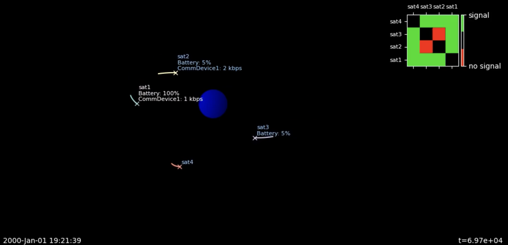

# PASEOS
PASEOS - PAseos Simulates the Environment for Operating multiple Spacecraft 


Disclaimer: This project is currently under development. Use at your own risk.

<!-- TABLE OF CONTENTS -->
<details open="open">
  <summary>Table of Contents</summary>
  <ol>
    <li><a href="#about-the-project">About the Project</a></li>
    <li><a href="#paseos-space-environment-simulation">PASEOS space environment simulation</a></li>
    <li><a href="#installation">Installation</a></li>
    <li><a href="#examples">Examples</a></li>
    <ul>
    <li><a href="#create-a-paseos-actor">Create a PASEOS actor</a></li>
    <li><a href="#set-an-orbit-for-a-paseos-spacecraftactor">Set an orbit for a PASEOS SpacecraftActor</a></li>
    <li><a href="#how-to-instantiate-paseos">How to instantiate PASEOS</a></li>
    <li><a href="#how-to-add-a-communication-device">How to add a communication device</a></li>
    <li><a href="#how-to-add-a-power-device">How to add a power device</a></li>
    <li><a href="#adding-other-actors-to-paseos">Adding other actors to PASEOS</a></li>
    <li><a href="#how-to-deal-with-paseos-activities">How to deal with PASEOS activities</a></li>
    <li><a href="#visualising-paseos">Visualising PASEOS</a></li>
    </ul>
    <li><a href="#system-design-of-paseos">System Design of PASEOS</a></li>
    <li><a href="#glossary">Glossary</a></li>
    <li><a href="#contributing">Contributing</a></li>
    <li><a href="#license">License</a></li>
    <li><a href="#contact">Contact</a></li>
  </ol>
</details>

## About the project

PASEOS is a `Python` module that simulates the environment to operate multiple spacecraft. In particular, PASEOS offers the user some utilities to run their own [activities](#activity) by taking into account both operational and onboard (e.g. limited-power-budget, radiation and thermal effects) constraints. <br>  PASEOS is designed to be:

* **open-source**: the source code of PASEOS is available under a GPL license.
* **fully-decentralised**:  one instance of `PASEOS` shall be executed in every node, i.e. individual spacecraft (actor), of the emulated spacecraft. Each instance of `PASEOS` is responsible for handling the user [activities](#activity) executed on that node (the local actor) while keeping track of the status of the other nodes. In this way, the design of `PASEOS` is completely decentralised and independent of the number of nodes of the constellation. Because of that, both single-node and multi-node scenarios are possible.
* **application-agnostic**: each user operation that has to be executed on a node is modelled as an [activity](#activity). The user is only required to provide the code to run and some parameters (e.g., power consumption) for each [activity](#activity). Thus, activities can be any code the user wants to simulate running on a spacecraft and thereby `PASEOS` is completely application-agnostic. Conceivable applications range from modelling constellations to training machine learning methods.

<br> The project is being developed by [$\Phi$-lab@Sweden](https://www.ai.se/en/data-factory/f-lab-sweden) in the frame of a collaboration between [AI Sweden](https://www.ai.se/en/) and the [European Space Agency](https://www.esa.int/) to explore distributed edge learning for space applications. For more information on `PASEOS` and $\Phi$-lab@Sweden, please take a look at the recording of the $\Phi$-lab@Sweden [kick-off event](https://www.youtube.com/watch?v=KuFRCcNxLgo&t=2365s).

## PASEOS space environment simulation

PASEOS allow simulating the effect of onboard and operational constraints on user-registered [activities](#activity). The image above showcases the different phenomena considered (or to be implemented) in PASEOS.

## Installation
`pip` and `conda` support will follow in the near future.

For now, first of all clone the [GitHub](https://github.com/aidotse/PASEOS.git) repository as follows ([Git](https://git-scm.com/) required):

```
git clone https://github.com/aidotse/PASEOS.git
```

To install PASEOS you can use [conda](https://docs.conda.io/en/latest/) as follows:

```
cd PASEOS
conda env create -f environment.yml
```
This will create a new conda environment called ``PASEOS`` and install the required software packages.
To activate the new environment, you can use:

```
conda activate paseos
```

Alternatively, you install PASEOS by using [PyPy](https://www.pypy.org/) as follows:

```
cd PASEOS
pip install -e .
```

## Examples
The next examples will introduce you to the use of PASEOS.

### Create a PASEOS actor
The code snippet below shows how to create a `PASEOS` [actor](#actor) named **mySat** of type [SpacecraftActor](#spacecraftactor). [pykep](https://esa.github.io/pykep/) is used to define the satellite [epoch](https://en.wikipedia.org/wiki/Epoch_(astronomy)) in format [mjd2000](https://en.wikipedia.org/wiki/Julian_day) format. <br>
[actors](#actor) are created by using an `ActorBuilder`. The latter is used to define the [actor](#actor) `scaffold` that includes the [actor](#actor) minimal properties. In this way, [actors](#actor) are build in a modular fashion that enable their use also for non-space applications.  
 
```py 
import pykep as pk
import paseos
from paseos import ActorBuilder, SpacecraftActor
# Define an actor of type SpacecraftActor of name mySat
sat_actor = ActorBuilder.get_actor_scaffold(name="mySat", 
                                       actor_type=SpacecraftActor, 
                                       epoch=pk.epoch(0))
```

### Set an orbit for a PASEOS SpacecraftActor
Once you have defined a [SpacecraftActor](#spacecraftactor), you can assign a [Keplerian orbit](https://en.wikipedia.org/wiki/Kepler_orbit) to it. To this aim, you need to define central body the [SpacecraftActor](#spacecraftactor) is orbiting around and specify its position and velocity (in the central body's [inertial frame](https://en.wikipedia.org/wiki/Inertial_frame_of_reference) and an epoch. In this case, we will use `Earth` as a central body.

```py 
import pykep as pk
import paseos
from paseos import ActorBuilder, SpacecraftActor
# Define an actor of type SpacecraftActor of name mySat
sat_actor = ActorBuilder.get_actor_scaffold(name="mySat", 
                                       actor_type=SpacecraftActor, 
                                       epoch=pk.epoch(0))

# Define the central body as Earth by using pykep APIs.
earth = pk.planet.jpl_lp("earth")

# Let's set the orbit of sat_actor.
ActorBuilder.set_orbit(actor=sat_actor, 
                       position=[10000000, 0, 0], 
                       velocity=[0, 8000.0, 0], 
                       epoch=pk.epoch(0), central_body=earth)
```
### How to add a communication device
The following code snippet shows how to add a communication device to a [SpacecraftActors] (#spacecraftactor). A communication device is needed to model the communication between [SpacecraftActors] (#spacecraftactor) or a [SpacecraftActor](#spacecraftactor) and [GroundstationActor](#ground-stationactor). Currently, given the maximum transmission data-rate of a communication device, PASEOS calculates the maximum data that can be transmitted by multiplying the transmission data-rate by the length of the communication window. The latter, is calculated by taking into account the period for which two actors are in line-of-sight.

```py
import pykep as pk
import paseos
from paseos import ActorBuilder, SpacecraftActor
# Define an actor of type SpacecraftActor of name mySat
sat_actor = ActorBuilder.get_actor_scaffold(name="mySat", 
                                       actor_type=SpacecraftActor, 
                                       epoch=pk.epoch(0))
# Add a communication device
ActorBuilder.add_comm_device(actor=sat_actor, 
                             device_name="my_communication_device", # Communication device name
                             bandwidth_in_kbps=100000) # Bandwidth in kbps. 
```

### How to add a power device
The following code snippet shows how to add a power device to a [SpacecraftActor](#spacecraftactor). At the moment, only battery device is supported. 
Moreover, PASEOS assumes that battery will be charged by solar panels, which will provide energy thanks to the incoming solar radiation when the spacecraft is not in eclipse.

```py
import pykep as pk
import paseos
from paseos import ActorBuilder, SpacecraftActor
# Define an actor of type SpacecraftActor of name mySat
sat_actor = ActorBuilder.get_actor_scaffold(name="mySat", 
                                       actor_type=SpacecraftActor, 
                                       epoch=pk.epoch(0))
# Add a power device                                     
ActorBuilder.set_power_devices(actor=sat_actor, 
                               battery_level_in_Ws=100, # Battery level at the start of the simulation in Ws
                               max_battery_level_in_Ws=2000, # Max battery level in Ws
                               charging_rate_in_W=10) # Charging rate in W
```

### How to instantiate PASEOS
We will now show how to create an instance of PASEOS. An instance of PASEOS shall be bounded to one PASEOS [actor](#actor) that we call [local actor](#local-actor).

```py 
import pykep as pk
import paseos
from paseos import ActorBuilder, SpacecraftActor
# Define an actor of type SpacecraftActor of name mySat (that will be the local actor)
local_actor = ActorBuilder.get_actor_scaffold(name="mySat", 
                                       actor_type=SpacecraftActor, 
                                       epoch=pk.epoch(0))
# initialize PASEOS simulation
sim = paseos.init_sim(local_actor) 
```
### Adding other actors to PASEOS
Once you have instantiated a PASEOS simulation, you can add other PASEOS [actors](#actor) to the simulation. <br>
The next code snippet will add both a [SpacecraftActor](#spacecraftactor) and a  [GroundstationActor](#ground-stationactor) (`other_sat`). An orbit is set for `other_sat`, which is placed around Earth at position `(x,y,z)=(-10000,0,0)` and velocity `(vx,vy,vz)=(0,-8000,0)` at epoch `epoch=pk.epoch(0)`. Please, notice that an orbit shall be placed for a [SpacecraftActor](#spacecraftactor) before being added to a PASEOS instance. <br>
 The latter (`grndStation`) will be placed at coordinates `(lat,lon)=(79.002723, 14.642972)` and elevation of 0 m. <br> You cannot add a power device and an orbit to a `GroundstationActor`.

```py 
import pykep as pk
import paseos
from paseos import ActorBuilder, SpacecraftActor
# Define an actor of type SpacecraftActor of name mySat (that will be the local actor)
local_actor = ActorBuilder.get_actor_scaffold(name="mySat", 
                                       actor_type=SpacecraftActor, 
                                       epoch=pk.epoch(0))

# Let's set the orbit of local_actor.
ActorBuilder.set_orbit(actor=local_actor, 
                       position=[10000000, 0, 0], 
                       velocity=[0, 8000.0, 0], 
                       epoch=pk.epoch(0), central_body=earth)

# Initialize PASEOS simulation
sim = paseos.init_sim(local_actor) 

# Create another SpacecraftActor
other_spacraft_actor = ActorBuilder.get_actor_scaffold(name="other_sat", 
                                      actor_type=SpacecraftActor, 
                                      epoch=pk.epoch(0))

# Let's set the orbit of other_spacraft_actor.
ActorBuilder.set_orbit(actor=other_spacraft_actor, 
                       position=[-10000000, 0, 0], 
                       velocity=[0, -8000.0, 0], 
                       epoch=pk.epoch(0), central_body=earth)

#Create GroundstationActor
grndStation = GroundstationActor(name="grndStation", epoch=today)

#Set the ground station at lat long 79.002723 / 14.642972 and ith elevation 0m
ActorBuilder.set_ground_station_location(grndStation, latitude=79.002723, longitude=14.642972, elevation=0)

# Adding other_spacraft_actor to PASEOS.  
sim.add_known_actor(other_spacraft_actor)   

# Adding grndStation to PASEOS.  
sim.add_known_actor(grndStation) 
```
### How to deal with PASEOS activities
PASEOS enables the user to register their [activities](#activity) that will be executed on the `local actor`. <br> 
To register an activity, it is first necessary to define an asynchronous [activity function](#activity-function). The following code snippet shows how to create an [activity function](#activity-function) `activity_function_A` that takes an input argument and returns its value multiplied by two. Then it waits 0.1 s before concluding the activity. <br>
Please, notice that the output value is placed in `args[1][0]`, which is returned as reference.

```py 
#Activity function
async def activity_function_A(args):
  activity_in=args[0]
  activity_out=activity_in * 2
  args[1][0]=activity_out
  await asyncio.sleep(0.1) #Await is needed inside an async function.
```

It is possible to associate a [constraint function](#constraint-function) with each [activity](#activity) to ensure that some particular constraints are met during the [activity](#activity) execution. When constraints are not met, the activity is interrupted. 
The next code snippet shows how to create a [constraint function](#constraint-function) that returns `True` when its input is positive and `False` otherwise.

```py 
#Activity function
async def constraint_function_A(args):
  constraint_in=args[0]
  return (constraint_in > 0)
```

It is also possible to define an [on termination](#on-termination-function) to perform some specific operations when on termination of the [activity](#activity). The next code snippet shows how to create an [on termination](#on-termination-function) that prints "activity (activity_A) ended." on termination. 

```py 
#Activity function
async def on_termination_function_A(args):
  #Fetching input
  activity_name=args[0]
  print("Activity ("+str(activity_name)+") ended.")
```

Finally, you can register an activity `activity_A` by using the previously defined [activity function](#activity-function), [constraint function](#constraint-function) and [on termination](#on-termination-function). The user needs to specify the power consumption associated with the activity.

```py 
# Register an activity that emulate event detection
sim.register_activity(
    "activity_A", 
    activity_function=activity_function_A, 
    power_consumption_in_watt=10, 
    constraint_function=constraint_function_A,
    on_termination_function=on_termination_function_A
)
```
Once an activity is registered, the user shall call `perform_activity(...)` to run the registered activity. 
The next snippet will summarize the previous ones and showcase how to perform the activity  `activity_A` to proving an input equal to 1. <br>
Please, notice that performing activity requires to have equipped the local actor with a power device. Please, refer to the example [How to add a power device](#how-to-add-a-power-device).

```py
import pykep as pk
import paseos
from paseos import ActorBuilder, SpacecraftActor
import asyncio 
# Define an actor of type SpacecraftActor of name mySat (that will be the local actor)
local_actor = ActorBuilder.get_actor_scaffold(name="mySat", 
                                       actor_type=SpacecraftActor, 
                                       epoch=pk.epoch(0))
# Define the central body as Earth by using pykep APIs.
earth = pk.planet.jpl_lp("earth")

# Let's set the orbit of sat_actor.
ActorBuilder.set_orbit(actor=local_actor, 
                       position=[10000000, 0, 0], 
                       velocity=[0, 8000.0, 0], 
                       epoch=pk.epoch(0), central_body=earth)

# Add a power device                                     
ActorBuilder.set_power_devices(actor=local_actor, 
                               battery_level_in_Ws=100, # Battery level at the start of the simulation in Ws
                               max_battery_level_in_Ws=2000, # Max battery level in Ws
                               charging_rate_in_W=10) # Charging rate in W

# initialize PASEOS simulation
sim = paseos.init_sim(local_actor) 

#Activity function
async def activity_function_A(args):
  activity_in=args[0]
  activity_out=activity_in * 2
  args[1][0]=activity_out
  await asyncio.sleep(0.1) #Await is needed inside an async function.

#Activity function
async def constraint_function_A(args):
  constraint_in=args[0]
  return (constraint_in > 0)

#Activity function
async def on_termination_function_A(args):
  #Fetching input
  activity_name=args[0]
  print("Activity ("+str(activity_name)+") ended.")

# Register an activity that emulate event detection
sim.register_activity(
    "activity_A", 
    activity_function=activity_function_A, 
    power_consumption_in_watt=10, 
    constraint_function=constraint_function_A,
    on_termination_function=on_termination_function_A
)

#Creatie an input variable for activity
activity_in=1

#Create a placeholder variable to contain the output-
#It is created as a list so its first value is edited as reference by the activity function.
activity_out=[None]

#Constraint value to check. If you set a negative value, constraints will be not met.
constraint_to_check=2

#The termination function input is the activity name
activity_name="activity_A"

#Run the activity
sim.perform_activity("activity_A", 
                      activity_func_args=[activity_in, activity_out],
                      constraint_func_args=[constraint_to_check],
                      termination_func_args=[activity_name],
                            )
#Print return value
print("The output of the activity function is: ", activity_out[0])
```

### Visualising PASEOS
Navigate to paseos/visualization to find a jupyter notebook containing examples of how to visualize PASEOS.
Visualization can be done in interactive mode or as an animation that is saved to disc.
In the figure below, Earth is visualized in the center as a blue sphere with different spacecraft in orbit.
Each spacecraft has a name and if provided, a battery level and a communications device.
The local device is illustrated with white text.
In the upper-right corner, the status of the communication link between each spacecraft is shown.
Finally, the time in the lower left and lower right corners correspond to the epoch and the PASEOS local simulation time.

<p align="center">
  <a href="https://github.com/aidotse/PASEOS/">
    
  </a>
  <p align="center">
    Snapshot of PASEOS visualization
  </p>
</p>

## System Design of PASEOS

<p align="center">
  <a href="https://github.com/aidotse/PASEOS/">
    
  </a>
  <p align="center">
    Description of PASEOS data structure
  </p>
</p>

<p align="center">
  <a href="https://github.com/aidotse/PASEOS/">
    
  </a>
  <p align="center">
    Description of PASEOS workflow on an individual device
  </p>
</p>

## Glossary
* ### Activity
  An activity is the abstraction that PASEOS uses to keep track of specific actions performed by a [SpacecraftActor](#spacecraftactor) upon a request from the user. To register an activity, an user shall first create an [activity function](#activity-function), which describes the operation to be performed, and provide information on the power-consumption due to the activity execution. <br>PASEOSis responsible for the execution of the activity and for updating the system status depending on the effects of the activity (e.g., by discharging they satellite battery).<br>
  When registering an activity, the user can specify a [constraint-function](#constraint-function) to specify constraints to be met during the execution of the activity and an an [on termination](#on-termination) function to specify additional operations to performed by PASEOS on termination of the activity function.


* ### Activity function
  User-defined function emulating any operation to be executed in a PASEOS a [SpacecraftActor](#spacecraftactor). Activity functions are necessayr to register [activities](#activity). Activity functions might include data transmission, house-keeping operations, onboard data acquisition and processing, and others.

* ### Actor
  Since PASEOS is fully-decentralised, each node of a PASEOS constellation shall run an instance of PASEOS modelling all the nodes of  that constellation.  The abstraction of a constellation node inside a PASEOS instace is a PASEOS `actor`. 

* ### Constraint function
  A constraint function is an asynchronous function that can be used by the PASEOS user to specify some constraints that shall be met during the execution of an activity.

* ### GroundstationActor
  `PASEOS actor` emulating a ground station.  

* ### Local actor
  The `local actor` is the `actor` whose behavior is modelled by the locally running PASEOS instance.

* ### On-termination function
  A on-termination function is an asynchronous function that can be used by the PASEOS user to specify some operations to be executed on termination of predefined PASEOS user.

* ### SpacecraftActor
  `PASEOS actor` emulating a spacecraft or a satellite. 

## Contributing
The ```PASEOS``` project is open to contributions. To contribute, you can open an [issue](https://github.com/gomezzz/MSMatch/issues) to report a bug or to request a new feature. If you prefer discussing new ideas and applications, you can contact us via email (please, refer to [Contact](#contact)).
To contribute, please proceed as follow:

1. Fork the Project
2. Create your Feature Branch (`git checkout -b feature/AmazingFeature`)
3. Commit your Changes (`git commit -m 'Add some AmazingFeature'`)
4. Push to the Branch (`git push origin feature/AmazingFeature`)
5. Open a Pull Request

## License
Distributed under the GPL-3.0 License.

## Contact
Created by $\Phi$[-lab@Sweden](https://www.ai.se/en/data-factory/f-lab-sweden).

* Pablo Gómez - pablo.gomez at esa.int, pablo.gomez at ai.se
* Gabriele Meoni - gabriele.meoni at esa.int, gabriele.meoni at ai.se
* Johan Östman - johan.ostman at ai.se
* Vinutha Magal Shreenath - vinutha at ai.se