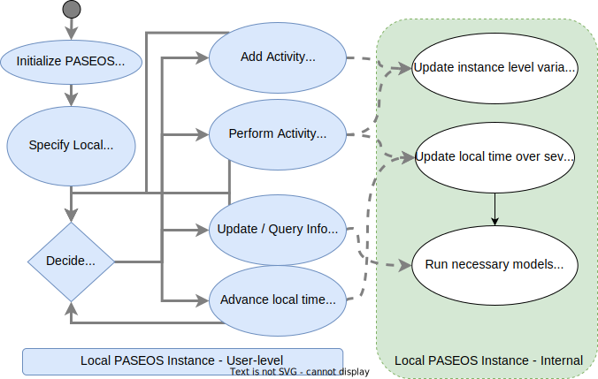

# PASEOS
PASEOS - PAseos Simulates the Environment for Operating multiple Spacecraft 


This project is currently under development. Use at your own risk. :)

<!-- TABLE OF CONTENTS -->
<details open="open">
  <summary>Table of Contents</summary>
  <ol>
    <li><a href="#about-the-project">About the Project</a></li>
    <li><a href="#installation">Installation</a></li>
    <li><a href="#contributing">Contributing</a></li>
    <li><a href="#examples">Examaples</a></li>
    <ul>
    <a href="#visualising-paseos">Visualising PASEOS</a></li>
    </ul>
    <li><a href="#system-design-of-paseos">System Design of PASEOS</a></li>
    <li><a href="#glossary">Glossary</a></li>
    <li><a href="#contact">Contact</a></li>
  </ol>
</details>

## About the project
`PASEOS` is a `Python` module that simulates the environment to operate multiple specraft. In particular, `PASEOS` offers the user some utilities to run their own [activities](#activity) by taking into account both operational and onboard (e.g. limited-power-budget, radiation and thermal effects) constraints. <br>  `PASEOS` is designed to:

* **open-source**: the source of `PASEOS` are available at this [GitHub](https://github.com/aidotse/PASEOS.git) repository. 
* **fully-decentralised**:  one instance of `PASEOS` shall be executed in every node of the emulated spacecraft swarm. Each instance of `PASEOS` is responsible of the user [activities](#activity) executed in that node while keeping track of the status of the other nodes. In this way, the design of `PASEOS` is completely decentralised and independent on the number of nodes of the constellation. Because of that, both single-node and multi-node scenarios are possibles.
* **application-agnostic**: each user operation that has to be executed in a node is modelled as an [activity](#activity). The user is required to provide the code and some parameters (e.g., power-consumption) for each [activity](#activity) that shall be executed in a `PASEOS` node. In this way, `PASEOS` is completely application-agnostic.

<br> The project was developed by [$\Phi$-lab@Sweden](https://www.ai.se/en/data-factory/f-lab-sweden) in the frame of the collbaboration between [AI Sweden](https://www.ai.se/en/) and the [European Space Agency](https://www.esa.int/) to explore distributed edge learning for space applications. For more information on `PASEOS` and $\Phi$-lab@Sweden, please take a look at the recordings on the $\Phi$-lab@Sweden [kick-off event](https://www.youtube.com/watch?v=KuFRCcNxLgo&t=2365s).

## Installation
First of all clone the [GitHub](https://github.com/aidotse/PASEOS.git) repository as follows ([Git](https://git-scm.com/) required):

```
git clone https://github.com/aidotse/PASEOS.git
```

To install `PASEOS` you can use [conda](https://docs.conda.io/en/latest/) as follow:

```
cd PASEOS
conda env create -f environment.yml
```
This will create a new conda environment called ```paseos``` and install the required software packages.
To activate the new environment, you can use:

```
conda activate paseos
```

Alternatively, you install `PASEOS` by using [PyPy](https://www.pypy.org/) as follows:

```
cd PASEOS
pip install -e .
```

## Contributing
The ```PASEOS``` project is open to contributions. To contribute, you can open an [issue](https://github.com/gomezzz/MSMatch/issues) to report a bug or to request a new feature. If you prefer discussing new ideas and applications, you can contact us via email (please, refer to [Contact](#contact)).
To contribute, please proceed as follow:

1. Fork the Project
2. Create your Feature Branch (`git checkout -b feature/AmazingFeature`)
3. Commit your Changes (`git commit -m 'Add some AmazingFeature'`)
4. Push to the Branch (`git push origin feature/AmazingFeature`)
5. Open a Pull Request

## Examples
### Visualising PASEOS
Navigate to paseos/visualization to find a jupyter notebook containing examples of how to visualize PASEOS.
Visualization can be done in interactive mode or as an animation that is saved to disc.
In the figure below, Earth is visualized in the center as a blue sphere with different spacecraft in orbit.
Each spacecraft has a name and if provided, a battery level and a communications device.
The local device is illustrated with white text.
In the upper-right corner, the status of the communication link between each spacecraft is shown.
Finally, the time in the lower left and lower right corners correspond to the epoch and the PASEOS local simulation time.

<p align="center">
  <a href="https://github.com/aidotse/PASEOS/">
    
  </a>
  <p align="center">
    Snapshot of PASEOS visualization
  </p>
</p>

## System Design of PASEOS

<p align="center">
  <a href="https://github.com/aidotse/PASEOS/">
    
  </a>
  <p align="center">
    Description of PASEOS data structure
  </p>
</p>

<p align="center">
  <a href="https://github.com/aidotse/PASEOS/">
    
  </a>
  <p align="center">
    Description of PASEOS workflow on an individual device
  </p>
</p>

## Glossary
* ### Activity
  Any operation performed by a [Spacecraft-actor](#spacecraftactor) that shall be implemented in `PASEOS`. Activities might include data transmission, house-keeping operations, onboard data acquisition and processing, and others.

* ### Actor
  Since `PASEOS` is fully-decentralised, each node of a `PASEOS` constellation shall run an instance of `PASEOS` modelling all the nodes of  that constellation.  The abstraction of a constellation node inside a `PASEOS` instace is a `PASEOS` `actor`. 
 
* ### Local actor
  The `actor` in a `PASEOS` instance that models the behavior and the status of the node that runs that `PASEOS` instance is called `local actor`. 

* ### Ground station-actor
  `PASEOS actor` emulating a ground station.  

* ### Spacecraft-actor
  `PASEOS actor` emulating a spacecraft or a satellite. 


## Contact
Created by [$\Phi$-lab@Sweden](https://www.ai.se/en/data-factory/f-lab-sweden).

* Pablo Gómez - pablo.gomez at esa.int, pablo.gomez at ai.se
* Gabriele Meoni - gabriele.meoni at esa.int, gabriele.meoni at ai.se
* Johan Östman - johan.ostman at ai.se
* Vinutha Magal Shreenath - vinutha at ai.se